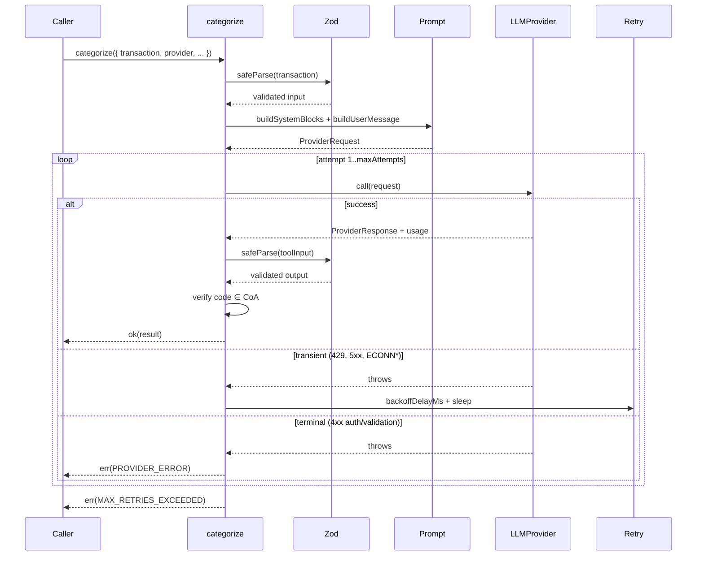

# agentic-bookkeeper

> Production-grade agentic Chart-of-Accounts categorisation for South African bank transactions, powered by Claude.

[](https://github.com/ArnovHeerden/agentic-bookkeeper/actions/workflows/ci.yml)
[](https://github.com/ArnovHeerden/agentic-bookkeeper/actions/workflows/codeql.yml)
[](LICENSE)
[](tsconfig.json)
[](package.json)
[](#testing)

A small, focused TypeScript library that takes an ambiguous bank transaction — `"SHELL ULTRA CITY BLOEMFONTEIN, R3,950"` — and returns a Zod-validated chart-of-accounts categorisation: account code, confidence score, VAT applicability, and a one-sentence rationale. The reasoning engine is Claude with forced tool-use against a 141-account SA Pty Ltd Chart of Accounts.

Extracted as a focused module from [Axiomatics](https://axiomatics.co.za) — a production agentic accounting platform — to demonstrate the patterns that distinguish a hobby LLM project from one a senior team would ship: structured outputs, prompt caching, retry classification, observability hooks, multi-provider abstraction, and an evaluation harness with measurable accuracy.

## Why this exists

Bank-transaction categorisation looks like a string-matching problem and isn't. The same merchant description (`"SHELL ULTRA CITY"`) can map to four different accounts depending on intent (employee fuel reimbursement vs. delivery vehicle vs. director's personal car claimed back), VAT status (standard-rated vs. exempt vs. non-VATable), and entity type (Pty Ltd shareholder loan vs. sole prop drawings). Production accounting systems can't just keyword-match — they need a model that reasons about IFRS rules, SARS classifications, and SA-specific bookkeeping conventions, then explains itself. This library is the agentic core of that reasoning, isolated and tested.

## What it looks like

```text
$ ANTHROPIC_API_KEY=sk-ant-... npm run example

agentic-bookkeeper — example
Company:   Karoo Coffee Roasters (Pty) Ltd
Categorising 20 transactions...

ID     │ Description                          │      Amount │ Code   │ Account                          │   Conf
────────────────────────────────────────────────────────────────────────────────
tx-01  │ ABSA INTERNET — RENT MARCH           │      -R8,500│ 6200   │ Rent Expense                     │   0.97
tx-02  │ MTN BUSINESS — FIBRE 100MBPS         │      -R1,245│ 6330   │ Internet & Telephone             │   0.96
tx-06  │ ETHIOPIA COFFEE IMPORTERS — BEANS    │     -R15,400│ 5300   │ Direct Materials                 │   0.88
tx-10  │ TRANSFER FROM A VAN HEERDEN — CAPITAL│     +R50,000│ 2260   │ Shareholder's Loan               │   0.94
tx-11  │ SHELL ULTRA CITY BLOEMFONTEIN        │      -R3,950│ 6920   │ Fuel & Oil                       │   0.92
tx-14  │ SARS VAT 201 PERIOD 02/2026          │      -R8,200│ 2150   │ VAT Output                       │   0.95
tx-18  │ SARS PENALTY — VAT 201 LATE FILING   │      -R1,200│ 6955   │ Penalties & Fines                │   0.96
tx-19  │ DONATION — KAROO HOSPICE NPO 18A     │      -R5,000│ 6965   │ Donations                        │   0.97
...
────────────────────────────────────────────────────────────────────────────────

Summary
  Categorised: 20/20 successful
  Tokens:      102,450 input / 1,840 output
  Cache:       97,800 read, 4,650 write       ← cache_read after first call
  Cost:        $0.0123 USD
  Avg / tx:    $0.0006 USD
  Wall-clock:  18.3s
```

The first transaction pays the cache_write premium for both system blocks (rules + accounts list). Every subsequent call pays the cache_read rate (~10% of full input). On a 20-transaction run that's roughly a 90% reduction in input cost.

## Quickstart

```ts
import { categorize, AnthropicProvider } from "agentic-bookkeeper";

const provider = new AnthropicProvider({ apiKey: process.env.ANTHROPIC_API_KEY! });

const result = await categorize({
  transaction: { description: "SHELL ULTRA CITY BLOEMFONTEIN", amount: -3950 },
  provider,
});

if (result.ok) {
  console.log(result.value);
  // {
  //   accountCode: "6920",
  //   accountName: "Fuel & Oil",
  //   confidence: 0.92,
  //   vatApplicable: true,
  //   reasoning: "Shell forecourt — vehicle fuel; standard 15% input VAT applies."
  // }
} else {
  console.error(result.error.kind, result.error.message);
}
```

The function returns a discriminated `Result<CategorizationResult, CategorizeError>` — failures are typed values, not thrown exceptions, so callers can't forget to handle them.

## Architecture



Full walkthrough in [docs/ARCHITECTURE.md](docs/ARCHITECTURE.md). Decision rationale in [docs/adr/](docs/adr/).

## Key design decisions

| Decision                                                                                                            | Why                                                                                                                |
| ------------------------------------------------------------------------------------------------------------------- | ------------------------------------------------------------------------------------------------------------------ |
| [ADR 0001 — Zod for output validation](docs/adr/0001-zod-for-output-validation.md)                                  | Compile-time types + runtime contract from one source. LLM output is untrusted by definition.                      |
| [ADR 0002 — `LLMProvider` interface](docs/adr/0002-provider-abstraction.md)                                         | Test the agent loop without an API key. Swap Anthropic for OpenAI/Gemini without touching `categorize()`.          |
| [ADR 0003 — Versioned prompt artifacts with `cache_control`](docs/adr/0003-prompt-versioning-with-cache-control.md) | Prompts are engineering artifacts. Cache the static parts (~90% input-cost reduction); A/B test versions in evals. |

## Production patterns covered

The patterns reviewers look for when judging "production AI" vs "tutorial AI":

- **Structured outputs.** [Zod schemas](src/schemas.ts) for input + output. Compile-time and runtime contracts derived from one source. LLM tool-call results are validated before they ever reach the caller; invalid output becomes a typed `PARSE_ERROR`, not a runtime crash.
- **Forced tool-use.** [`tool_choice: { type: "tool", name: ... }`](src/providers/anthropic.ts) — the model cannot reply with prose. Either it emits a structured tool call matching the schema, or the call fails fast.
- **Prompt caching.** [Cacheable system blocks](src/providers/anthropic.ts) marked with `cache_control: { type: "ephemeral" }`. Cuts input cost ~90% on warm calls. Token usage breakdown (cache_read / cache_write) propagated through the [cost layer](src/cost.ts) so observers can see real-world savings.
- **Multi-provider abstraction.** [`LLMProvider` interface](src/providers/types.ts) — `categorize()` is decoupled from any specific SDK. Ships with `AnthropicProvider`; adding `OpenAIProvider` or `GeminiProvider` is a 50-line file with no changes to the agent loop.
- **Retry classification.** [`isRetryable()`](src/retry.ts) distinguishes transient failures (408/425/429/500/502/503/504, ECONN\*) from terminal failures (auth, validation). Exponential backoff with full jitter to avoid thundering herd. No retry-forever loops on bad credentials.
- **Observability hooks.** [`Observer`](src/observability.ts) interface with `onTokens`, `onCost`, `onAttempt`, `onError`. Hooks that throw don't propagate into the agent loop — telemetry never breaks production.
- **Evaluation harness.** [25 labelled SA-specific transactions](evals/dataset.json) exercise the prompt's encoded reasoning rules (director loan vs share capital, Shell forecourts as fuel, Section 18A donations as NON-VAT, SARS penalties as non-deductible). Strict + tolerant accuracy reporting; CI-ready exit codes. See [evals/README.md](evals/README.md).
- **No API key needed for testing.** All 70 unit + integration tests run against [a `MockProvider` in process](tests/categorize.test.ts). `npm test` is fast (<200ms), deterministic, and offline-friendly.

## Data & compliance posture

The library itself processes a single transaction in-memory and returns a result. It does not:

- Persist user data anywhere
- Send telemetry to any third party
- Read environment variables at module load
- Make network calls except via the explicit `provider.call()` you injected

All sample data in `examples/` and `evals/` is fully synthetic — Karoo Coffee Roasters is fictional, references and amounts are fabricated, no real persons are named. This satisfies POPIA and GDPR de-identification principles for portfolio code: there is no personal data anywhere in the repository.

When integrating into a system that does process real customer data, treat `categorize()` as a pure function with no PII boundary — the only data leaving your process is what you pass in (transaction description + amount). The Anthropic API call is your responsibility to govern under your DPA with Anthropic; this library doesn't add any new data flows on top of theirs.

## Security posture

- **No secrets in code or git history.** Verified with `gitleaks` on every commit (pre-commit hook + CI). GitHub Secret Scanning + Push Protection enabled at the repo level.
- **Single secret to manage.** `ANTHROPIC_API_KEY` via `.env` (gitignored) or process env. No service accounts, no admin SDKs, no encryption keys.
- **Dependabot.** Weekly minor/patch dependency updates auto-PR'd. Major bumps require manual review (peer-dep coordination).
- **CodeQL.** GitHub's static-analysis scanner runs `security-and-quality` queries on every push.
- **Lock-file integrity.** `npm ci` in CI ensures reproducible installs from `package-lock.json`.
- **Vulnerability disclosure.** [SECURITY.md](SECURITY.md) — private GitHub Security Advisories preferred.

`npm audit` reports 0 vulnerabilities at time of writing.

## Development

```sh
npm install
npm run typecheck     # tsc --noEmit (strict mode)
npm run lint          # ESLint flat config + typescript-eslint
npm run format        # Prettier 3
npm test              # vitest run (70 tests, ~200ms)
npm run test:coverage # +v8 coverage, enforces 90/85/85/90 thresholds
npm run build         # emits dist/ — npm publish-ready
npm run secrets:scan  # gitleaks against the working tree
npm run example       # CLI demo (needs ANTHROPIC_API_KEY)
npm run eval          # accuracy harness (needs ANTHROPIC_API_KEY)
```

Pre-commit hooks (Husky 9) run `lint-staged` (eslint --fix + prettier --write on staged files) plus `gitleaks protect --staged`. Commit messages are validated against [Conventional Commits](https://www.conventionalcommits.org/) by `commitlint`.

## Testing

70 tests, 6 files, 95% line coverage. The test suite exercises:

| Area                                                         | File                                                                     |
| ------------------------------------------------------------ | ------------------------------------------------------------------------ |
| Zod schemas, Result helpers, error class                     | [`tests/schemas.test.ts`](tests/schemas.test.ts)                         |
| Retry classification + backoff distribution                  | [`tests/retry.test.ts`](tests/retry.test.ts)                             |
| Token-cost math + cache discount/premium                     | [`tests/cost.test.ts`](tests/cost.test.ts)                               |
| Observer safe-invoke contract                                | [`tests/observability.test.ts`](tests/observability.test.ts)             |
| Anthropic SDK request/response shape                         | [`tests/providers/anthropic.test.ts`](tests/providers/anthropic.test.ts) |
| Full agent flow (happy path + 5 error kinds + retry + hooks) | [`tests/categorize.test.ts`](tests/categorize.test.ts)                   |

Coverage thresholds (lines 90, branches 85, functions 85, statements 90) are enforced in CI — adding code without tests fails the build.

## License

MIT — see [LICENSE](LICENSE). Use it, fork it, learn from it, ship it.

## Author

[**Arno van Heerden**](https://github.com/ArnovHeerden) — AI Engineer & Automation Specialist behind [Axiomatics](https://axiomatics.co.za), a production agentic accounting platform built solo on TypeScript, Next.js 16, Firebase, and Anthropic Claude as the primary LLM. The platform's multi-provider gateway also routes through OpenAI and Google Gemini; this library ships the Anthropic provider with the abstraction in place to add the others without touching the agent loop.

Try the live demo: [axiomatics.co.za/demo](https://axiomatics.co.za/demo).
