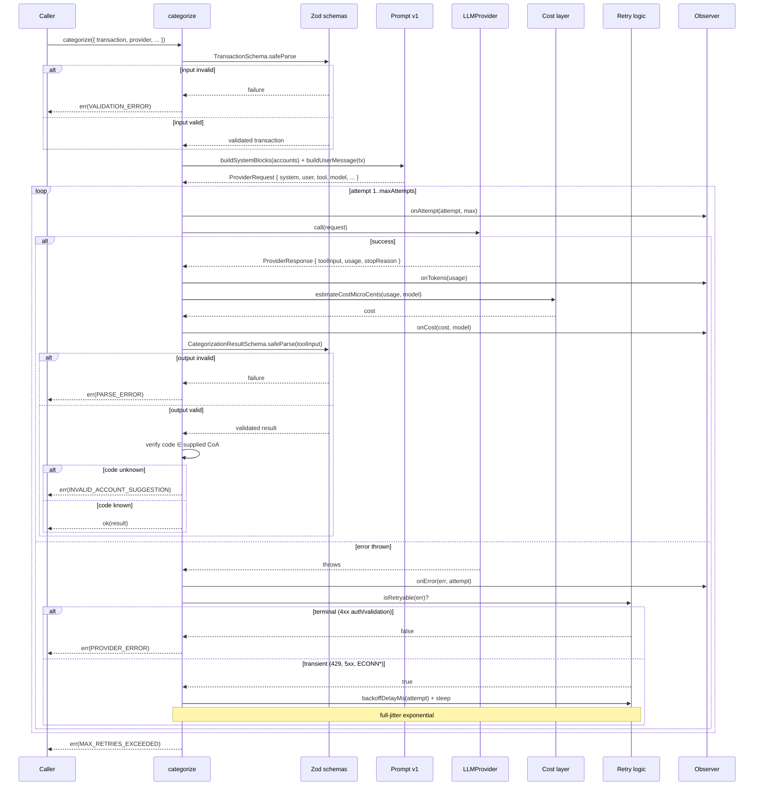
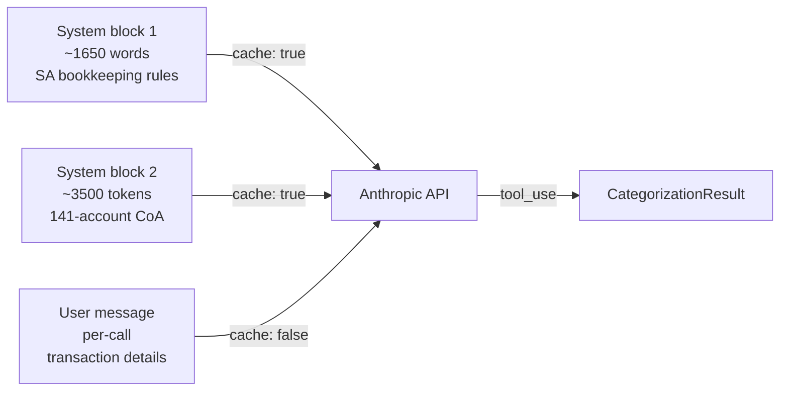

# Architecture

The library is a single agent function — `categorize()` — that orchestrates six concerns kept in separate modules so each can be tested, swapped, or replaced in isolation.

## Module map

```
src/
├── index.ts              # public API barrel
├── categorize.ts         # the agent function — orchestrates everything below
├── schemas.ts            # Zod schemas + Result<T,E> + CategorizeError
├── retry.ts              # backoff/jitter + isRetryable() error classification
├── cost.ts               # per-model pricing + cache_read/write math
├── observability.ts      # Observer interface + safe-invoke wrapper
├── prompts/
│   └── categorize-v1.ts  # versioned prompt artifact (rules + tool schema)
├── providers/
│   ├── types.ts          # LLMProvider interface + ProviderRequest/Response
│   └── anthropic.ts      # AnthropicProvider — translates to/from SDK shape
└── internal/
    └── coa-sa-pty.ts     # 141-account SA Pty Ltd Chart of Accounts reference
```

## The agent loop



## Prompt-cache flow

Each call sends two static system blocks plus a per-call user message:



**First call (cold)** — both system blocks pay the cache_write premium (~125% of base input rate). Total input cost is roughly 1.25× a non-cached call.

**Subsequent calls (warm)** — both system blocks pay the cache_read rate (~10% of base input rate). The per-call user message is the only fresh input. Effective input cost drops to roughly 10% of a non-cached call.

For a 20-transaction batch, the amortised input cost is ~14% of what a non-cached implementation would charge. The savings show up in the [`cost.ts`](../src/cost.ts) calculation as soon as `cache_read_input_tokens` appears in the `Usage` block.

## Why the Provider abstraction?

```mermaid
flowchart LR
    Categorize[categorize&#40;&#41;] -->|ProviderRequest| Interface[LLMProvider interface]
    Interface -->|ProviderResponse| Categorize

    Interface -.implements.- Anthropic[AnthropicProvider<br/>ships in 0.1.0]
    Interface -.implements.- OpenAI[OpenAIProvider<br/>future]
    Interface -.implements.- Gemini[GeminiProvider<br/>future]
    Interface -.implements.- Mock[MockProvider<br/>in tests/]
```



Three concrete benefits:

1. **Tests run without an API key** — `MockProvider` returns canned responses. 70 tests, <200ms, deterministic.
2. **Multi-provider future** — adding another provider is a 50-line file (translate the request shape, adapt the response). No changes to `categorize.ts`.
3. **A/B testing** — wrap a provider to log requests, measure latency, or compare model versions side-by-side without forking the agent.

The interface intentionally keeps the surface small: one `call(request) → response` method. Streaming, embeddings, and multi-turn aren't in scope for the v1 categoriser.

## Error taxonomy

`CategorizeError.kind` is a tagged union the caller can branch on without parsing message strings:

| Kind                         | Cause                                          | Caller action                               |
| ---------------------------- | ---------------------------------------------- | ------------------------------------------- |
| `VALIDATION_ERROR`           | Input transaction failed Zod parse             | Fix the input                               |
| `PARSE_ERROR`                | LLM tool input failed Zod parse                | Surface to logs; check prompt + tool schema |
| `INVALID_ACCOUNT_SUGGESTION` | LLM picked a code not in the supplied CoA      | Surface to logs; consider prompt tightening |
| `PROVIDER_ERROR`             | Terminal SDK error (4xx auth/validation)       | Check API key, request shape; do not retry  |
| `MAX_RETRIES_EXCEEDED`       | All `maxAttempts` consumed by transient errors | Provider degraded; back off and retry later |

The error class threads the underlying SDK error through `Error.cause`, so observability tooling (Sentry, Datadog) sees the full chain.

## What's deliberately not here

- **Streaming.** Not needed for a single-shot tool call returning a small JSON payload.
- **Multi-turn.** The categoriser is stateless by design; one transaction in, one categorisation out.
- **Embeddings.** No semantic search step — the agent reads the full CoA on every call (cheap with prompt caching).
- **Cross-transaction context.** Each call is independent. The prompt has no concept of "previously seen transactions" — by design, so categorisation is reproducible and auditable.
